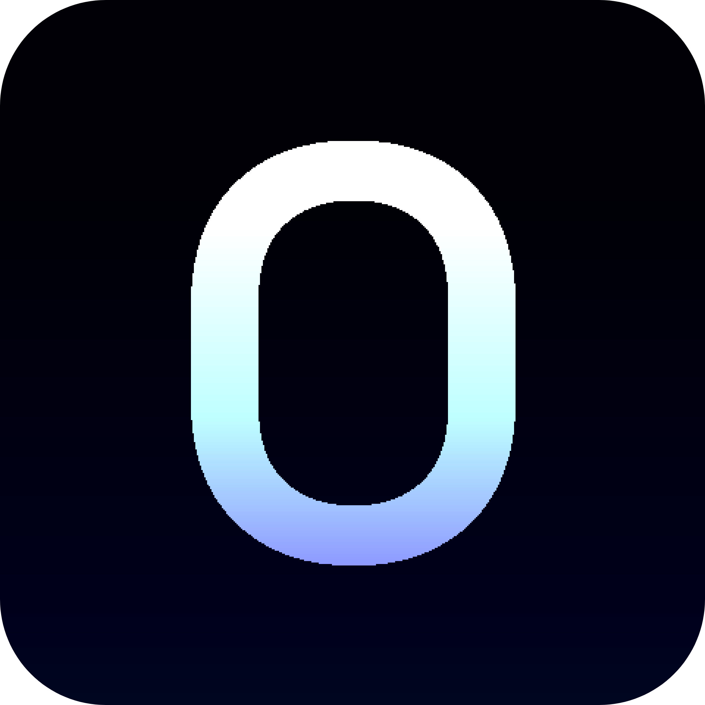

<div align="center">



# Oxygen

**A minimal, cross-platform media downloader**

[](https://www.python.org)
[](https://github.com)
[](https://github.com/yt-dlp/yt-dlp)
[](LICENSE)

Download videos and audio from **YouTube**, **SoundCloud**, **X (Twitter)**, **Instagram**, and **1000+ more sites** — with a clean, dark-first GUI.

</div>

---

## ✨ Features

- 🎬 **Video, Audio & Silent** download modes
- 🌐 **1000+ supported sites** via yt-dlp (YouTube, SoundCloud, X, Instagram, TikTok, Vimeo, and more)
- 📋 **Auto clipboard detection** — copies a link? Oxygen pastes it automatically
- ⚙️ **Settings panel** — theme color, app theme, download folder, language, clipboard toggle
- 🎨 **3 app themes** — OLED black, Dark, Light
- 🖌️ **8 accent colors** — Violet, Blue, Emerald, Red, Amber, Pink, Cyan, White
- 🌍 **Multi-language support** — drop a `.ini` file next to the app for any language
- 📦 **Dependency-free startup** — yt-dlp, Pillow, and ffmpeg install automatically on first run
- 🖥️ **Truly cross-platform** — Windows, macOS, Linux, single Python file

---

## 📸 Screenshots

> *(Add your screenshots here)*

---

## 🚀 Quick Start

### Prerequisites

- **Python 3.8+** — [python.org/downloads](https://www.python.org/downloads/)
  - Windows: check **"Add Python to PATH"** during install

Everything else (yt-dlp, Pillow, ffmpeg) installs automatically on first launch.

---

### 🪟 Windows

Double-click **`run_windows.bat`**

> No Python? The script opens the download page for you automatically.

---

### 🍎 macOS

```bash
# Make executable once
chmod +x run_macos.command

# Then double-click run_macos.command
# — or run from terminal:
./run_macos.command
```

---

### 🐧 Linux

```bash
# Make executable once
chmod +x run_linux.sh

# Run
./run_linux.sh
```

**Optional — add to your app menu:**

```bash
# Edit Oxygen.desktop first: replace /PATH/TO/ with your actual folder path
cp Oxygen.desktop ~/.local/share/applications/
```

---

### ▶ Run directly (any OS, if Python is installed)

```bash
pip install yt-dlp Pillow
python oxygen.py
```

---

## 🎛️ Usage

| Step | Action |
|------|--------|
| 1 | Copy a link from YouTube, SoundCloud, Instagram, X, etc. |
| 2 | Oxygen **auto-pastes** it (or click the `paste` button) |
| 3 | Choose a mode: **auto** (best quality), **audio** (MP3), or **mute** (video only) |
| 4 | Click **download** — your folder is saved from last time |
| 5 | When done, open the file or reveal it in Explorer / Finder |

---

## ⚙️ Settings

Open the gear icon `⚙` in the top-right corner.

| Setting | Description |
|---------|-------------|
| **Theme Color** | 8 accent color swatches |
| **App Theme** | OLED (pure black), Dark, Light |
| **Language** | Drop a `.ini` file next to the app to add languages |
| **Download Location** | Change the default save folder |
| **Auto-paste** | Toggle clipboard watching on/off |

Settings are saved to `~/.oxygen_cfg.json` and persist across launches.

---

## 🌍 Adding a Language

1. Create a file named `fr.ini`, `de.ini`, `ja.ini` etc. **next to `oxygen.py`**
2. Copy the contents of `en.ini` and translate the values
3. Open **Settings → LANGUAGE** → select your language → Save

**Example `tr.ini` snippet:**
```ini
[oxygen]
title = Oxygen
subtitle = medya indirici
btn_download = ↓   indir
btn_paste = 📋  yapıştır
warn_no_link = Lütfen önce bir bağlantı yapıştırın.
```

A full **Turkish translation** (`tr.ini`) is included out of the box.

---

## 📁 File Structure

```
oxygen/
├── oxygen.py            # Main application
├── oxygen.ico           # Window icon
├── oxygen.png           # Logo (optional — replaces default icon in UI)
├── en.ini               # English language strings
├── tr.ini               # Turkish language strings
├── run_windows.bat      # Windows one-click launcher
├── run_macos.command    # macOS one-click launcher
├── run_linux.sh         # Linux one-click launcher
├── Oxygen.desktop       # Linux app menu entry
├── requirements.txt     # pip dependencies
└── README.md
```

---

## 🛠️ Supported Sites (highlights)

| Platform | URL |
|----------|-----|
| YouTube | `youtube.com`, `youtu.be` |
| SoundCloud | `soundcloud.com` |
| X / Twitter | `x.com`, `twitter.com` |
| Instagram | `instagram.com` |
| TikTok | `tiktok.com` |
| Vimeo | `vimeo.com` |
| Dailymotion | `dailymotion.com` |
| + 1000 more | [Full list →](https://github.com/yt-dlp/yt-dlp/blob/master/supportedsites.md) |

---

## 🧩 Tech Stack

| Component | Library |
|-----------|---------|
| GUI | `tkinter` (stdlib — no install needed) |
| Downloading | [`yt-dlp`](https://github.com/yt-dlp/yt-dlp) |
| Image handling | [`Pillow`](https://python-pillow.org) |
| Audio processing | [`ffmpeg`](https://ffmpeg.org) (auto-installed) |

---

## 🤝 Contributing

Pull requests are welcome!

```bash
git clone https://github.com/yourusername/oxygen
cd oxygen
python oxygen.py
```

To add a new language, submit a `.ini` translation file as a PR.

---

## 📄 License

MIT © 2025 — see [LICENSE](LICENSE) for details.

---

<div align="center">
  Made with ♥ and Python
</div>
