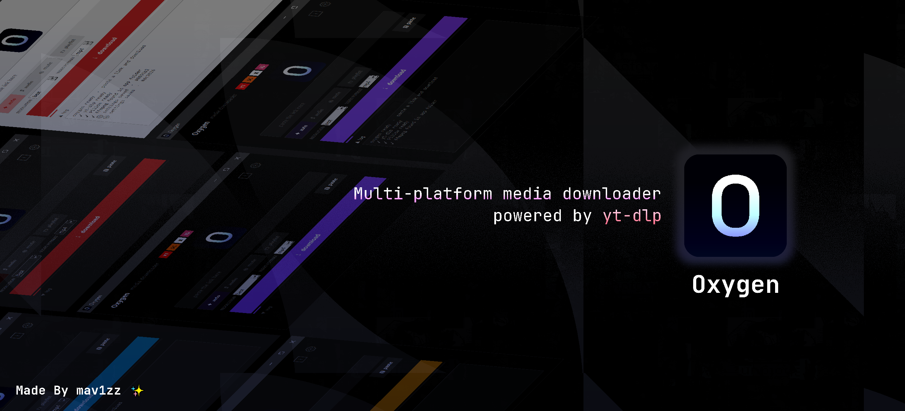

<div align="center">

<!-- ╔══════════════════════════════════════════════════╗ -->
<!--              OXYGEN — TOP BANNER                     -->
<!-- ╚══════════════════════════════════════════════════╝ -->


# Oxygen

**Multi-platform media downloader powered by yt-dlp.**  
Supports YouTube, SoundCloud, X, Instagram, and 1000+ sites.

[](https://www.python.org/)
[](https://github.com/yt-dlp/yt-dlp)
[](https://ffmpeg.org/)
[](LICENSE)
</div>

---

## 🛠️ Built With

> Tools, libraries, and technologies used in this project.

| Technology | Role | Version |
|---|---|---|
| 🐍 **Python** | Core language & runtime | 3.8+ |
| 📥 **yt-dlp** | Video/audio extraction engine | Latest |
| 🎞️ **FFmpeg** | Media merging & audio extraction | Any recent |
| 🖼️ **tkinter** | GUI framework (built into Python) | stdlib |
| 📋 **pyperclip** | Clipboard read/paste support | Latest |
| 📦 **PyInstaller** | Packages app into `.exe` for Windows | Latest |
| 🤖 **Claude AI** | Assisted in development & code generation | — |

---

## 🌍 Supported Sites

yt-dlp supports **1000+ websites** out of the box. Below are some of the most popular platforms:

### ⭐ Featured Platforms

| Platform | Description |
|---|---|
| ▶️ **YouTube** | Videos, Shorts, Playlists, Live streams |
| 🎵 **SoundCloud** | Tracks, playlists, user pages |
| 🐦 **X (Twitter)** | Tweets with video/gif content |
| 📸 **Instagram** | Reels, posts, stories, IGTV |
| 🎵 **TikTok** | Videos & user feeds |

<details>
<summary><b>📋 View all 1000+ supported sites (click to expand)</b></summary>

> Full list: [github.com/yt-dlp/yt-dlp/blob/master/supportedsites.md](https://github.com/yt-dlp/yt-dlp/blob/master/supportedsites.md)

</details>

---

<!-- ╔══════════════════════════════════════════════════╗ -->
<!--              QUICK START BANNER                      -->
<!-- ╚══════════════════════════════════════════════════╝ -->

<div align="center">
   
</div>

## ⚡ Quick Start

### Method 1 — Run with Python

1. Install dependencies:
   ```
   pip install -r requirements.txt
   ```
2. Launch the app:
   ```
   python oxygen.py
   ```

---

### Method 2 — Build a Windows EXE 📦

1. *(Optional but recommended)* Place `ffmpeg.exe` in the project folder.
2. Double-click **`build.bat`**.
3. Find `Oxygen.exe` inside `dist\Oxygen\`.

> [!TIP]
> Download ffmpeg from https://ffmpeg.org/download.html — pick the Windows build, extract the archive, and copy `ffmpeg.exe` into the project folder. ffmpeg is required for merging video+audio and audio extraction. Oxygen will attempt to auto-install it if not found.

---

## 🎛️ Features

| Mode      | Description                            |
|-----------|----------------------------------------|
| `auto`    | Best quality video + audio, merged     |
| `audio`   | Audio only — choose format & bitrate   |
| `mute`    | Video only — no audio track            |

**Resolution** *(auto / mute)*: best · 4K · 1440p · 1080p · 720p · 480p · 360p · 240p · worst  
**Video format** *(auto / mute)*: mp4 · mkv · webm · avi · mov  
**Audio quality** *(audio)*: best · 320k · 256k · 192k · 128k · 96k · 64k  
**Audio format** *(audio)*: mp3 · m4a · opus · flac · wav · aac

- ✅ Playlist download support
- ✅ Auto-paste from clipboard
- ✅ Dark / OLED / Light themes with custom accent color
- ✅ Multi-language support via `.ini` files

---

## 🌐 Adding a Language

Create a `.ini` file (e.g. `tr.ini`) next to `oxygen.py`:

```ini
[oxygen]
title = Oxygen
btn_download = ↓   indir
btn_paste = 📋  yapıştır
```

Any key from `BUILTIN_EN` in `oxygen.py` can be overridden.

---

## 📂 Project Structure

```
oxygen_project/
├── oxygen.py           ← main application
├── build.bat           ← Windows EXE builder
├── requirements.txt
├── ffmpeg.exe          ← place here (downloaded separately)
├── oxygen.ico          ← app icon (optional)
└── oxygen.png          ← logo shown in-app (optional)
```

After building:

```
dist/Oxygen/
├── Oxygen.exe          ← run this
├── ffmpeg.exe          ← auto-copied if present
└── (other bundled files)
```

---

> [!NOTE]
> Controls update automatically based on the selected mode. ffmpeg must be present for video+audio merging and audio-only extraction.

---

<!-- ╔══════════════════════════════════════════════════╗ -->
<!--                  CREDITS BANNER                      -->
<!-- ╚══════════════════════════════════════════════════╝ -->

<div align="center">

```
╔═══════════════════════════════════════════════════════╗
║                                                       ║
║                  ✦  CREDITS  ✦                        ║
║                                                       ║
╚═══════════════════════════════════════════════════════╝
```

**Oxygen** is built on the shoulders of amazing open-source projects.

| Project | What it does |
|---|---|
| [yt-dlp](https://github.com/yt-dlp/yt-dlp) | The powerful download engine behind everything |
| [FFmpeg](https://ffmpeg.org/) | Media processing & format conversion |
| [Python](https://www.python.org/) | The language that powers the app |
| [PyInstaller](https://pyinstaller.org/) | Windows EXE packaging |
| [Claude AI](https://claude.ai/) | AI pair programming & development assistance |

<br/>

*Made with ❤️ · Powered by open source*

[](https://github.com/yt-dlp/yt-dlp)
[](https://ffmpeg.org/)
[](https://www.python.org/)

</div>
